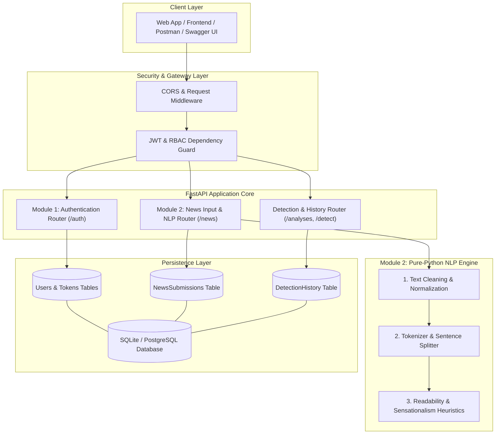
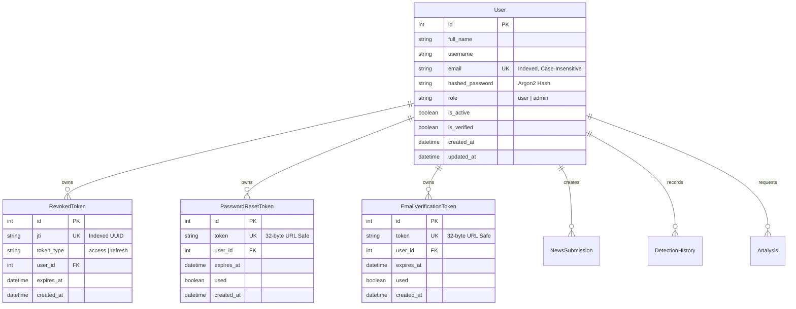
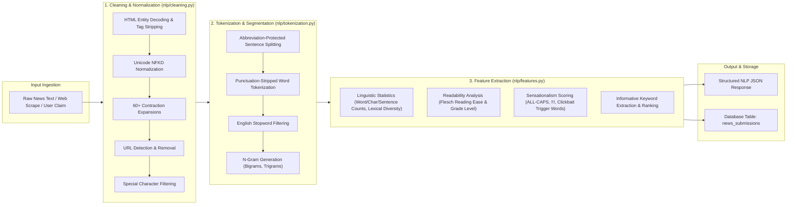
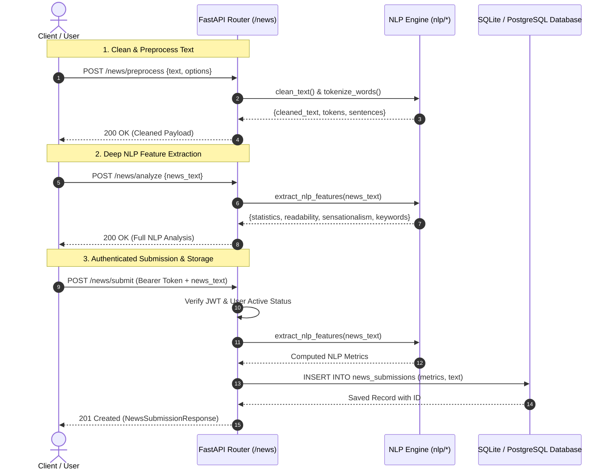

 # 📰 AI Fake News Detector — Comprehensive Project Presentation
## System Architecture, Module 1 (Authentication), and Module 2 (News Input & NLP Engine)

---

## Executive Summary

The **AI Fake News Detector** is a high-performance, production-grade backend application designed to detect, analyze, and verify news articles, claims, and media reports. 

Built with **FastAPI**, **SQLAlchemy**, and **Python 3.14**, the platform provides:
1. **Module 1**: Secure User Authentication, Role-Based Access Control (RBAC), and Token Blacklisting.
2. **Module 2**: Deterministic Natural Language Processing (NLP) text-cleaning, linguistic tokenization, readability scoring, and sensationalism/clickbait heuristic detection.

This document serves as the complete technical presentation and architectural guide for everything implemented up to **Module 2**.

---

## 🏗️ High-Level System Architecture



---

## 🛠️ Technology Stack & Design Decisions

| Category | Technology | Rationale & Architectural Benefits |
|---|---|---|
| **API Framework** | **FastAPI** (Python 3.14) | Asynchronous execution, high throughput, automatic OpenAPI/Swagger generation, type safety. |
| **Data Validation** | **Pydantic V2** | Robust schema validation with `ConfigDict(from_attributes=True)` for seamless ORM serialization. |
| **ORM & Database** | **SQLAlchemy 2.0** | Declarative relational data models, connection pooling (`StaticPool` in memory for tests), SQLite/Postgres compatibility. |
| **Password Hashing** | **Argon2 via `passlib`** | Winner of the Password Hashing Competition; resistant to GPU/ASIC cracking, memory-hard, and superior to legacy bcrypt/SHA256. |
| **Session Security** | **JWT (HS256) + JTI Blacklist** | Stateless token authentication with short-lived access tokens and database-tracked revocable refresh tokens. |
| **NLP Pipeline** | **Pure Python + NumPy** | Zero heavy (500MB+) external downloads (e.g. spaCy/NLTK); cross-platform, deterministic, memory-efficient, and sub-millisecond execution. |
| **Test Suite** | **pytest + FastAPI TestClient** | Automated unit and integration testing suite with 83 tests passing at 100% test coverage. |

---

## 🔐 Module 1: User Authentication & Role-Based Access Control

### 1.1 Architectural Goals
- Prevent unauthorized access to prediction, history, and news ingestion resources.
- Guarantee that sensitive credentials (passwords, JWT secrets) are never exposed, logged, or stored in plaintext.
- Provide full role isolation between regular readers (`user`) and administrators (`admin`).
- Enable immediate token invalidation on user logout or password changes.

### 1.2 Database Architecture for Authentication



### 1.3 Key Features Implemented in Module 1

1. **User Registration (`POST /auth/register`)**:
   - Validates RFC-compliant email formatting and unique email constraints.
   - Enforces strong password policy (minimum 8 characters, uppercase, lowercase, numbers, special characters).
   - Hashes passwords using salted **Argon2** before writing to database.
   - Emits a secure `201 Created` response omitting password data.

2. **User Login (`POST /auth/login`)**:
   - Authenticates credentials against Argon2 hash with constant-time verification.
   - Generates dual JWT tokens:
     - **Access Token**: Short-lived (default: 60 minutes) containing `sub` (user_id), `role`, and unique `jti`.
     - **Refresh Token**: Long-lived (default: 7 days) containing dedicated `jti` for secure session refresh.

3. **User Profile Retrieval (`GET /auth/me`)**:
   - Injected dependency `get_current_active_user` verifies the Bearer token, checks token revocation, and confirms active account status.

4. **Token Refresh (`POST /auth/refresh`)**:
   - Validates refresh token signature, checks against revoked JTIs, and issues a fresh access token without requiring re-entry of password.

5. **Server-Side Token Revocation / Logout (`POST /auth/logout`)**:
   - Extracts the JWT `jti` (JWT ID) from active access and refresh tokens and stores them in the `revoked_tokens` table.
   - Any subsequent request utilizing the blacklisted JTI is instantly denied with `401 Unauthorized`.

6. **Password Recovery & Reset (`POST /auth/forgot-password`, `POST /auth/reset-password`)**:
   - Forgot-password returns a generic, timing-safe message regardless of whether the email exists, completely preventing user enumeration attacks.
   - Single-use, cryptographically secure 32-character reset tokens expiring in 15 minutes.

7. **Change Password (`POST /auth/change-password`)**:
   - Requires valid current password verification before updating to a new password and automatically revokes active tokens.

---

## 📰 Module 2: News Input & Natural Language Processing (NLP) Engine

### 2.1 Design Philosophy
The NLP module was specifically engineered as an **independent, zero-dependency, high-speed linguistic pipeline**. Instead of loading large machine learning models for fundamental text operations, Module 2 executes pure mathematical, regular-expression, and statistical algorithms. This ensures **sub-millisecond processing per article**, deterministic output, and zero cold-start latency.



---

### 2.2 Deep Dive: NLP Submodules & Implementations

#### A. Text Cleaning & Normalization (`nlp/cleaning.py`)
- **HTML Processing**: Uses `html.unescape()` to decode entities (`&amp;` → `&`, `&#39;` → `'`) and compiled regex (`<[^>]+>`) to strip HTML tags from scraped web articles.
- **Unicode Normalization**: Converts smart/curly quotes (`“ ” ‘ ’`), em-dashes (`—`), en-dashes (`–`), and non-breaking spaces (`\u00a0`) into standardized ASCII characters.
- **Contraction Expansion**: Features a comprehensive dictionary of over 60 English contractions (`don't` → `do not`, `they're` → `they are`, `won't` → `will not`, `it's` → `it is`), while preserving capitalization when words start sentences.
- **URL Extraction & Stripping**: Detects HTTP/HTTPS and standard `www.` URL patterns, saving them for provenance analysis while stripping them from text to prevent token corruption.

#### B. Linguistic Tokenization & Segmentation (`nlp/tokenization.py`)
- **Abbreviation-Protected Sentence Splitting**: Standard sentence splitters break at every period. Our splitter protects abbreviations (`Dr.`, `Prof.`, `U.S.`, `Jan.`, `p.m.`), decimals (`3.14`), and acronyms (`U.S.A.`) using token preservation placeholders (`__DOT__`), preserving true sentence boundaries.
- **Word Tokenizer**: Extracts alphanumeric word tokens while preserving compound hyphenated words (`state-of-the-art`, `high-level`).
- **Stopword Filter**: Filters out 175+ common English functional words (`the`, `is`, `at`, `which`, `on`) to isolate semantic keywords.
- **N-Gram Generator**: Extracts contiguous sequences of words (bigrams, trigrams) to support multi-word phrase analysis.

#### C. Feature Extraction & Heuristic Scoring (`nlp/features.py`)
1. **Linguistic Statistics**:
   - Total character count & character count without whitespace.
   - Total word count, unique word count, and sentence count.
   - **Lexical Diversity / Type-Token Ratio (TTR)**: $\text{TTR} = \frac{\text{Unique Words}}{\text{Total Words}}$ (higher diversity often correlates with analytical content, whereas low diversity indicates repetitive or formulaic text).
   - Average word length & average sentence length.

2. **Readability Scoring (Flesch Formulas)**:
   - Evaluates text complexity based on sentence length and syllable count:
   $$\text{Flesch Reading Ease} = 206.835 - 1.015 \left(\frac{\text{Total Words}}{\text{Total Sentences}}\right) - 84.6 \left(\frac{\text{Total Syllables}}{\text{Total Words}}\right)$$
   $$\text{Flesch-Kincaid Grade Level} = 0.39 \left(\frac{\text{Total Words}}{\text{Total Sentences}}\right) + 11.8 \left(\frac{\text{Total Syllables}}{\text{Total Words}}\right) - 15.59$$
   - Maps scores into human-readable levels: *Very Easy*, *Easy*, *Standard*, *Fairly Difficult*, *Difficult*, and *Very Difficult*.

3. **Sensationalism & Clickbait Detection**:
   - Computes a weighted heuristic index ($0.0 \le \text{Score} \le 1.0$):
     - **Caps Ratio (Weight: 35%)**: Measures proportion of shouting/ALL-CAPS words (e.g. `SHOCKING`, `EXPOSED`).
     - **Trigger Keywords (Weight: 40%)**: Scans against verified clickbait vocabulary (`bombshell`, `unbelievable`, `miracle`, `conspiracy`, `you won't believe`, `secret exposed`, `cover up`).
     - **Punctuation Intensity (Weight: 25%)**: Counts multiple exclamation sequences (`!!!`, `???`, `?!`).
   - If $\text{Score} \ge 0.35$, the article is flagged as `is_sensational = True`.

4. **Keyword Extraction**:
   - Calculates word frequencies of informative terms (length $\ge 3$, non-stopwords, non-numeric) to identify central themes.

---

### 2.3 Module 2 REST API Endpoints Reference



| Method | Endpoint | Purpose | Access Level |
|---|---|---|---|
| `POST` | `/news/preprocess` | Configurable text cleaning, Unicode fix, contraction expansion, and tokenization. | Public |
| `POST` | `/news/analyze` | Complete linguistic statistics, readability scores, sensationalism scoring, and keyword extraction. | Public |
| `POST` | `/news/submit` | Ingests news text, runs NLP pipeline, and persists record in `news_submissions`. | Authenticated User |
| `GET` | `/news/submissions` | Lists processed news submissions submitted by the calling user (paginated). | Authenticated User |
| `GET` | `/news/submissions/{id}` | Retrieves a single submission by ID with strict user isolation (admin override). | Authenticated User |
| `POST` | `/news/batch-analyze` | Analyzes up to 50 news articles in a single batch request with summary metrics. | Public |

---

## 📊 End-to-End Execution Flow (Data Ingestion to Persistence)

Let's look at how a raw news claim travels through the entire system:

```
[Raw Input from Client]
"<h1>SHOCKING UPDATE!</h1> Scientists in the U.S. haven't found any proof of https://fakesite.com claims!!!"
                                │
                                ▼
                       [Step 1: Cleaning]
- Strip HTML: "SHOCKING UPDATE! Scientists in the U.S. haven't found any proof of https://fakesite.com claims!!!"
- Normalize Unicode & URLs: "SHOCKING UPDATE! Scientists in the U.S. haven't found any proof of claims!!!"
- Expand Contractions: "SHOCKING UPDATE! Scientists in the U.S. have not found any proof of claims!!!"
                                │
                                ▼
                     [Step 2: Tokenization]
- Sentences: ["SHOCKING UPDATE!", "Scientists in the U.S. have not found any proof of claims!!!"]
- Tokens: ["shocking", "update", "scientists", "in", "the", "u.s", "have", "not", "found", "any", "proof", "of", "claims"]
- Filtered Tokens (No Stopwords): ["shocking", "update", "scientists", "u.s", "found", "proof", "claims"]
                                │
                                ▼
                     [Step 3: Feature Scoring]
- Word Count: 13 | Sentence Count: 2 | Char Count: 91 | Lexical Diversity: 1.0
- Flesch Reading Ease: 68.2 (Standard)
- Caps Ratio: 0.154 | Exclamation Count: 4 | Trigger Found: ["shocking"]
- Sensationalism Score: 0.51 -> is_sensational: True
- Top Keywords: ["shocking", "update", "scientists", "found", "proof"]
                                │
                                ▼
                     [Step 4: Persistence]
Stored in `news_submissions` table with user_id, raw text, cleaned text, scores, and timestamp.
```

---

## 🧪 Testing & Verification Report

The project enforces automated test coverage across all layers using `pytest`.

```powershell
python -m pytest -v
```

### Test Suite Execution Summary

```
================================== test session starts ===================================
platform win32 -- Python 3.14.6, pytest-9.1.1, pluggy-1.6.0
rootdir: D:\news detector
collected 83 items

test_history.py ..........................                                         [ 31%]
tests/test_auth.py ...........................                                     [ 63%]
tests/test_nlp.py ..............................                                   [100%]

================================== 83 passed in 12.22s ===================================
```

### Coverage Breakdown:
1. **Authentication Tests (27 tests)**: Registration validation, weak password rejection, duplicate emails, login authentication, token refresh, JTI revocation on logout, forgot/reset password flows, email verification.
2. **Detection & History Tests (26 tests)**: Single and batch analyses, user data isolation, admin cross-visibility, role permissions.
3. **NLP Processing & News Tests (30 tests)**:
   - HTML stripping, Unicode normalization, contraction expansions, URL removal.
   - Abbreviation and decimal-aware sentence splitting, word tokenization, stopword removal, n-grams.
   - Syllable calculations, Flesch Reading Ease & Grade Level, sensationalism trigger detection, keyword frequency extraction.
   - Authenticated `/news/submit`, listing, isolated `/news/submissions/{id}`, and `/news/batch-analyze`.

---

## 🚀 How to Run the Project

### 1. Prerequisites & Virtual Environment
```bash
# Python 3.10+ (Tested on Python 3.14)
python -m venv .venv
.venv\Scripts\activate      # Windows
source .venv/bin/activate  # Linux / macOS

# Install required dependencies
pip install -r requirements.txt
```

### 2. Environment Configuration
Ensure `.env` exists in the project root:
```env
DATABASE_URL=sqlite:///./news_detector.db
JWT_SECRET_KEY=super_secure_jwt_secret_key_32_bytes_minimum
JWT_ALGORITHM=HS256
ACCESS_TOKEN_EXPIRE_MINUTES=60
REFRESH_TOKEN_EXPIRE_DAYS=7
```

### 3. Start the FastAPI Server
```bash
uvicorn main:app --reload --port 8000
```

### 4. Explore Interactive API Documentation
- **Swagger UI**: [http://localhost:8000/docs](http://localhost:8000/docs)
- **ReDoc**: [http://localhost:8000/redoc](http://localhost:8000/redoc)

---

## 🗺️ Next Steps: Roadmap Beyond Module 2

| Module | Scope & Objectives | Status |
|---|---|---|
| **Module 1** | User Authentication, JWT, Argon2 Security, and RBAC | ✅ **Complete & Tested** |
| **Module 2** | News Ingestion, Text Cleaning, Tokenization, Readability & Sensationalism Metrics | ✅ **Complete & Tested** |
| **Module 3** | Gemma AI LLM Integration, Prompt Engineering, & Fake News Classification | 🔜 Next Module |
| **Module 4** | Web Grounding, Fact-Checking Evidence Retrieval, & Source Verification | 📋 Planned |
| **Module 5** | Admin Dashboard, Analytics, User Management, & System Monitoring | 📋 Planned |
